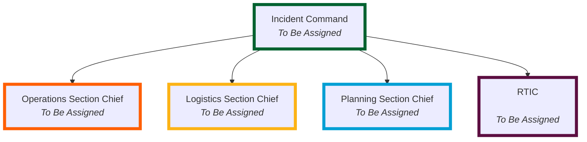

# ICS 207: Incident Organization Chart

```mermaid
flowchart TB
    ic["`Incident Command
    *To Be Assigned*`"]
    ops["`Operations Section Chief
    *To Be Assigned*`"]
    log["`Logistics Section Chief
    *To Be Assigned*`"]
    plan["`Planning Section Chief
    *To Be Assigned*`"]
    rtic["`RTIC
    #nbsp;
    *To Be Assigned*`"]

    ic --> ops
    ic --> log
    ic --> plan
    ic --> rtic

    classDef prairie stroke:#006230,stroke-width:4pt
    classDef orange stroke:#ff5f05,stroke-width:4pt
    classDef harvest stroke:#fcb316,stroke-width:4pt
    classDef arches stroke:#009fd4,stroke-width:4pt
    classDef berry stroke:#5c0e41,stroke-width:4pt

    class ic prairie
    class ops orange
    class log harvest
    class plan arches
    class rtic berry
```
